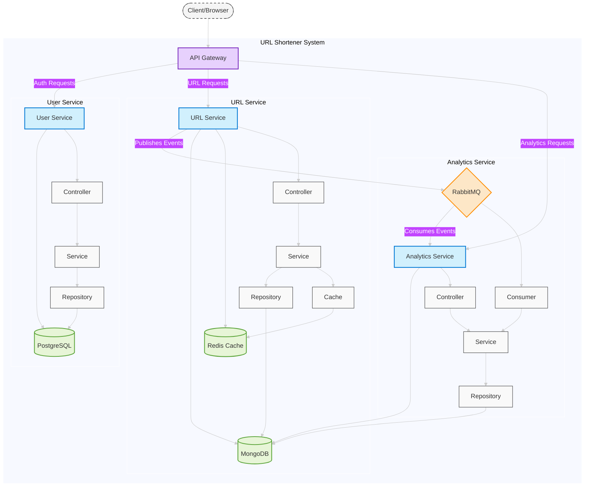

# 🚀 URL Shortener Microservices

A modern, scalable URL shortening platform built using microservices architecture. This project demonstrates my skills and best practices in building distributed systems with Node.js, TypeScript, Docker, Redis caching, and RabbitMQ event-driven communication.

## 📋 Overview

This robust URL shortener service provides:

- ✅ Fast URL shortening with custom or auto-generated codes
- ✅ User authentication and management
- ✅ Comprehensive analytics and tracking
- ✅ Scalable microservices architecture with distributed data stores
- ✅ High-performance caching using Redis
- ✅ Event-driven architecture with RabbitMQ
- ✅ Containerized deployment with Docker

## 🏗️ Architecture



## 🧩 Architectural Patterns & Design Principles

This project implements several industry-standard architectural patterns and design principles:

### Clean Architecture

- **Separation of Concerns**: Each service is organized into layers with clear boundaries
- **Domain-Driven Design**: Business logic is isolated from infrastructure concerns
- **Use Cases**: Business rules are defined as use cases in service layers
- **Dependency Rule**: Dependencies point inward, with inner layers unaware of outer layers

### Dependency Injection (DI)

- **Inversion of Control**: Using TypeScript-based DI containers for service instantiation
- **Testability**: Dependencies can be easily mocked for unit testing
- **Loose Coupling**: Components interact through abstractions rather than concrete implementations

### Repository Pattern

- **Data Access Abstraction**: Repository interfaces isolate business logic from data access
- **Persistence Ignorance**: Business logic remains independent of specific database implementations
- **Interchangeable Data Sources**: Ability to swap MongoDB, PostgreSQL, or other datastores with minimal code changes

### SOLID Principles

- **Single Responsibility**: Each class and module has one clear responsibility
- **Open/Closed**: Entities are open for extension but closed for modification
- **Liskov Substitution**: Interfaces are designed to ensure subtypes can be substituted for base types
- **Interface Segregation**: Small, focused interfaces prevent unnecessary dependencies
- **Dependency Inversion**: High-level modules depend on abstractions, not concrete implementations

### Event-Driven Architecture

- **Message Brokers**: RabbitMQ facilitates loose coupling between services
- **Asynchronous Communication**: Services communicate through events without direct dependencies
- **Eventual Consistency**: Data is synchronized across services asynchronously
- **Fault Tolerance**: Services can continue to operate despite failures in other services

### API Gateway Pattern

- **Single Entry Point**: Unified API interface for all client communications
- **Cross-Cutting Concerns**: Centralized handling of authentication, logging, and monitoring
- **Request Routing**: Dynamic routing of requests to appropriate microservices
- **API Composition**: Aggregation of data from multiple services for client requests

The system consists of four main microservices:

### 1. API Gateway

- Entry point for all client requests
- Handles request routing to appropriate services
- Implements rate limiting, security headers, and request validation
- Authentication middleware for protected endpoints

### 2. URL Service

- Core service for URL shortening functionality
- Creates and stores short URLs with MongoDB
- Uses Redis for caching frequently accessed URLs
- Publishes analytics events to RabbitMQ

### 3. User Service

- Manages user registration and authentication
- Stores user data in PostgreSQL with Prisma ORM
- Handles JWT token generation and validation
- Password encryption with bcrypt

### 4. Analytics Service

- Processes URL access events from RabbitMQ
- Tracks and stores analytics data in MongoDB
- Provides detailed analytics on URL performance
- Captures data on geographic location, referrers, browsers, devices, and OS

## 💾 Data Storage

- **PostgreSQL**: User accounts and related data
- **MongoDB**: URL mappings and analytics information
- **Redis**: High-performance caching for frequent URL lookups
- **RabbitMQ**: Message broker for event-driven communication between services

## 🔧 Tech Stack

- **Backend**: Node.js, Express, TypeScript
- **Databases**: PostgreSQL, MongoDB, Redis
- **Message Queue**: RabbitMQ
- **ORM/ODM**: Prisma (PostgreSQL), Mongoose (MongoDB)
- **Authentication**: JWT, bcrypt
- **Containerization**: Docker, Docker Compose
- **Testing**: Jest
- **Code Quality**: ESLint, Prettier

## 🛠️ Setup & Installation

### Prerequisites

- Docker and Docker Compose
- Node.js (for local development)

### Quick Start

1. Clone the repository

```bash
git clone https://github.com/yourusername/url-shortener-microservices.git
cd url-shortener-microservices
```

2. Create `.env` files for each service (see `.env.example` in each service directory)

3. Start all services using Docker Compose

```bash
cd volumes
docker-compose up -d
```

4. The services will be available at:
   - API Gateway: http://localhost:3000
   - User Service: http://localhost:3001
   - URL Service: http://localhost:3002
   - Analytics Service: http://localhost:3003

### Local Development

Each service can be run independently for development:

```bash
cd <service-directory>
npm install
npm run dev
```

## 📊 API Documentation

### URL Service

- `POST /api/urls` - Create a new short URL
- `GET /api/urls` - Get all URLs for authenticated user
- `GET /:shortCode` - Redirect to the original URL

### User Service

- `POST /api/users/register` - Register a new user
- `POST /api/users/login` - Login and get token
- `GET /api/users/me` - Get current user details

### Analytics Service

- `GET /api/analytics/:urlId` - Get analytics for a specific URL

## 🚀 Future Improvements

- Web dashboard for user management and analytics
- Custom domain support
- Advanced analytics visualizations
- QR code generation for short URLs
- Expiration dates for links
- API rate limiting tiers
- ELK Stack (Elasticsearch, Logstash, Kibana) for centralized logging and monitoring

## 👤 Author

Created by Vusal Huseynov as a demonstration of microservices architecture best practices using modern web technologies.

---

⭐ If you find this project useful, please consider giving it a star!
